# LindormMemobase

🧠 **智能记忆管理系统** - 为LLM应用提供强大的记忆提取和用户画像管理能力

LindormMemobase是一个专为大语言模型应用设计的轻量级记忆管理库，能够从对话中自动提取结构化信息、管理用户画像，并提供高效的向量搜索能力。基于阿里云Lindorm数据库，支持海量数据的高性能存储和检索。

## ✨ 核心特性

🎯 **智能记忆提取** - 自动从对话中提取用户偏好、习惯和个人信息  
👤 **结构化画像** - 按主题和子主题组织用户信息，构建完整用户画像  
🔍 **向量语义搜索** - 基于embedding的高效相似度搜索和上下文检索  
🚀 **高性能存储** - 支持Lindorm宽表和Search引擎，处理大规模数据  
🌍 **多语言支持** - 完善的中英文处理能力和本地化提示词  
⚡ **异步处理** - 高效的异步处理管道，支持批量数据处理  
🔧 **灵活配置** - 支持多种LLM和嵌入模型，可插拔的存储后端

## 🚀 快速开始

### 安装

```bash
# 开发环境安装
pip install -e .

# 从源码安装
git clone <repository-url>
cd lindorm-memobase
pip install -e .
```

### 基本使用

```python
import asyncio
from lindormmemobase import LindormMemobase, Config
from lindormmemobase.models.blob import ChatBlob, OpenAICompatibleMessage
from datetime import datetime

async def main():
    # 加载配置
    config = Config.load_config()
    memobase = LindormMemobase(config)
    
    # 创建对话数据
    messages = [
        OpenAICompatibleMessage(role="user", content="我最喜欢在周末弹吉他，特别是爵士乐"),
        OpenAICompatibleMessage(role="assistant", content="太棒了！爵士乐很有魅力，周末弹吉他是很好的放松方式")
    ]
    
    conversation_blob = ChatBlob(
        messages=messages,
        fields={"user_id": "user123", "session_id": "chat_001"},
        created_at=datetime.now()
    )
    
    # 提取记忆并构建用户画像
    result = await memobase.extract_memories(
        user_id="user123",
        blobs=[conversation_blob]
    )
    
    if result:
        print("✅ 记忆提取成功！")
        
        # 查看用户画像
        profiles = await memobase.get_user_profiles("user123")
        for profile in profiles:
            print(f"📋 主题: {profile.topic}")
            for subtopic, entry in profile.subtopics.items():
                print(f"  └── {subtopic}: {entry.content}")

asyncio.run(main())
```

### 上下文增强示例

```python
# 获取记忆增强的对话上下文
context = await memobase.get_conversation_context(
    user_id="user123",
    conversation=current_messages,
    max_token_size=2000
)

print(f"🧠 智能上下文: {context}")
```

## ⚙️ 配置设置

### 环境变量配置

1. 复制环境变量模板：
   ```bash
   cp example.env .env
   ```

2. 编辑 `.env` 文件，设置必要的API密钥：
   ```bash
   # LLM配置
   MEMOBASE_LLM_API_KEY=your-openai-api-key
   MEMOBASE_LLM_BASE_URL=https://api.openai.com/v1
   MEMOBASE_LLM_MODEL=gpt-3.5-turbo
   
   # 嵌入模型配置
   MEMOBASE_EMBEDDING_API_KEY=your-embedding-api-key
   MEMOBASE_EMBEDDING_MODEL=text-embedding-3-small
   
   # Lindorm数据库配置
   MEMOBASE_LINDORM_HOST=your-lindorm-host
   MEMOBASE_LINDORM_PORT=33060
   MEMOBASE_LINDORM_USERNAME=your-username
   MEMOBASE_LINDORM_PASSWORD=your-password
   MEMOBASE_LINDORM_DATABASE=memobase
   
   # Lindorm Search配置
   MEMOBASE_LINDORM_SEARCH_HOST=your-search-host
   MEMOBASE_LINDORM_SEARCH_PORT=9200
   MEMOBASE_LINDORM_SEARCH_USERNAME=your-search-username
   MEMOBASE_LINDORM_SEARCH_PASSWORD=your-search-password
   ```

3. 复制并自定义配置文件：
   ```bash
   cp cookbooks/config.yaml.example cookbooks/config.yaml
   ```

### 配置文件说明

- **`.env`**: 敏感信息（API密钥、数据库凭证）
- **`config.yaml`**: 应用配置（模型参数、功能开关、处理限制）
- **优先级**: 默认值 < `config.yaml` < 环境变量

## 🏗️ 系统架构

### 核心组件

- **`core/extraction/`**: 记忆提取处理管道
  - `processor/`: 数据处理器（摘要、提取、合并、组织）
  - `prompts/`: 智能提示词（支持中英文）
- **`models/`**: 数据模型（Blob、Profile、Response类型）
- **`core/storage/`**: 存储后端（Lindorm宽表、Search引擎）
- **`embedding/`**: 嵌入服务（OpenAI、Jina等）
- **`llm/`**: 大语言模型接口和完成服务
- **`core/search/`**: 搜索服务（用户画像、事件、上下文检索）

### 处理流水线

```
原始对话数据 → 内容截断 → 条目摘要 → [画像提取 + 事件处理] → 结构化响应
    ↓
  ChatBlob → 数据预处理 → LLM分析 → 向量化存储 → 检索增强
```

### 数据流向

```mermaid
graph LR
    A[对话输入] --> B[ChatBlob创建]
    B --> C[内容摘要]
    C --> D[记忆提取]
    D --> E[画像构建]
    E --> F[向量存储]
    F --> G[上下文检索]
    G --> H[增强响应]
```



## 📚 实战示例

查看 `cookbooks/` 目录获取完整的实用示例：

### 🎯 快速上手

- **[`quick_start.py`](cookbooks/quick_start.py)**: 核心API使用演示
- **[`simple_chatbot/`](cookbooks/simple_chatbot/)**: 简单聊天机器人实现

### 🧠 记忆增强聊天机器人

- **[`chat_memory/`](cookbooks/chat_memory/)**: 完整的记忆增强聊天机器人
  - **Web界面**: 现代化的实时流式聊天界面
  - **智能缓存**: 90%性能提升的缓存系统
  - **记忆可视化**: 实时查看用户画像和上下文
  - **多模式支持**: 命令行和Web双界面

### 🚀 快速体验记忆聊天机器人

```bash
# 进入聊天机器人目录
cd cookbooks/chat_memory/

# 启动Web界面（推荐）
./start_web.sh

# 或启动命令行版本
python memory_chatbot.py --user_id your_name
```

**Web界面特性**:
- 🌊 实时流式响应
- 🧠 上下文可视化
- 📱 响应式设计
- 📊 性能统计面板

## 🔧 开发构建

### 开发环境搭建

```bash
# 开发模式安装
pip install -e .

# 运行测试
pytest tests/ -v

# 运行测试并生成覆盖率报告
pytest tests/ --cov=lindormmemobase --cov-report=html
```

### 生产环境构建

使用 `build` 工具（推荐）:
```bash
# 安装构建工具
pip install build

# 构建wheel和源码分发包
python -m build

# 输出文件位于 dist/ 目录
ls dist/
# lindormmemobase-0.1.0-py3-none-any.whl
# lindormmemobase-0.1.0.tar.gz
```

直接使用 `setuptools`:
```bash
# 构建wheel包
python setup.py bdist_wheel

# 构建源码分发包
python setup.py sdist
```

### 从构建包安装

```bash
# 从wheel包安装
pip install dist/lindormmemobase-0.1.0-py3-none-any.whl

# 或从源码分发包安装
pip install dist/lindormmemobase-0.1.0.tar.gz
```

### 发布到PyPI

```bash
# 安装发布工具
pip install twine

# 先上传到TestPyPI测试
twine upload --repository-url https://test.pypi.org/legacy/ dist/*

# 正式发布到PyPI
twine upload dist/*
```

## 🧪 测试

```bash
# 运行所有测试
pytest tests/ -v

# 运行特定测试文件
pytest tests/test_lindorm_storage.py -v

# 生成HTML覆盖率报告
pytest tests/ --cov=lindormmemobase --cov-report=html
```

## 📋 系统要求

- **Python**: 3.12+
- **API服务**: OpenAI API密钥（LLM和嵌入服务）
- **数据库**: Lindorm宽表 或 MySQL
- **搜索引擎**: Lindorm Search 或 OpenSearch


MIT License - 详见 LICENSE 文件

## 🤝 贡献指南

我们欢迎社区贡献！参与方式：

1. **Fork** 本仓库
2. **创建** 功能分支 (`git checkout -b feature/AmazingFeature`)
3. **提交** 修改 (`git commit -m 'Add some AmazingFeature'`)
4. **推送** 到分支 (`git push origin feature/AmazingFeature`)
5. **创建** Pull Request

### 贡献类型
- 🐛 Bug修复
- ✨ 新功能开发
- 📚 文档改进
- 🧪 测试用例
- 🎨 代码优化

## 📞 支持与帮助

遇到问题或需要帮助：

- 📖 **查看文档**: `docs/` 目录包含详细文档
- 🍳 **参考示例**: `cookbooks/` 目录有实用示例
- 🐛 **报告问题**: 在仓库中创建Issue
- 💬 **功能建议**: 通过Issue分享您的想法

## 🌟 特别鸣谢

- 阿里云 Lindorm 团队提供的强大数据库支持
- OpenAI 提供的优秀LLM和嵌入服务
- 开源社区的宝贵贡献和反馈