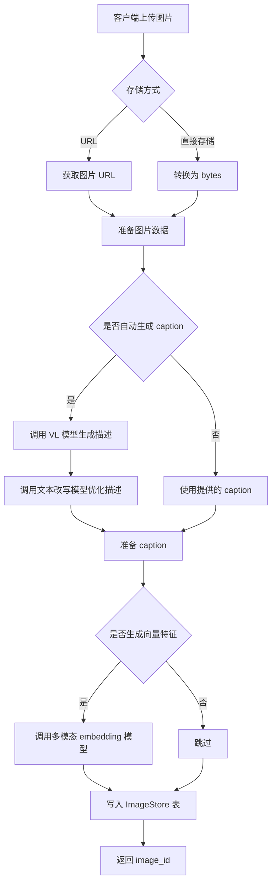
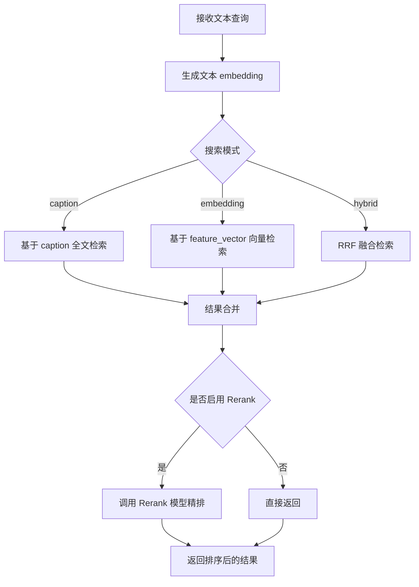
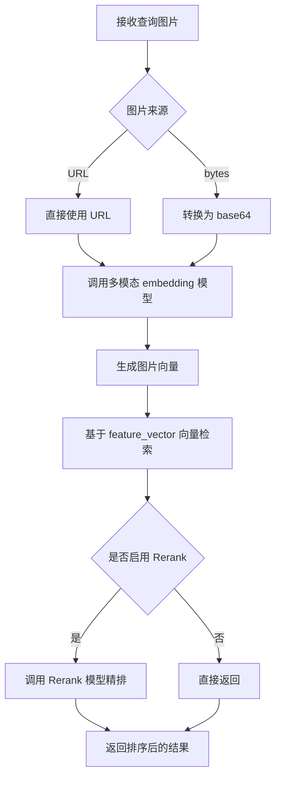

# 图片多模态存储与检索系统设计文档

## 1. 概述

本文档描述了 LindormMemobase 项目中图片多模态存储与检索系统的设计方案。该系统与现有的记忆系统独立运行，但共享 `project_id` 和 `user_id` 的命名空间。

### 1.1 设计目标

- 支持图片的场景信息和用户关联信息的统一存储
- 提供以图搜图、以文搜图的检索能力
- 与记忆系统解耦，独立链路、独立存储
- SDK 层面可复用配置，但接口和入口类分离

### 1.2 核心功能

1. **图片存储管理**：存储场景描述与图片来源（URL/可选二进制）
2. **多模态检索**：支持以图搜图、以文搜图（caption + 向量）
3. **用户图片查询**：支持按用户/项目过滤与关联查询
4. **可选生物特征扩展**：作为二期能力，不阻塞 MVP 交付

## 2. 存储方案设计

### 2.1 设计决策：MVP 单表 + 可扩展双表

**MVP 选择**：采用单表设计，将图片场景信息与用户关联信息合并存储，以最小成本交付检索能力。

**优点**：
- 查询简单，无需 JOIN
- 维护成本低，事务操作原子化
- 接口实现更快，交付节奏可控

**代价/边界**：
- 如果同一张图片属于多个用户，会产生数据重复（可接受但占用空间）
- 需要明确约束：`image_id` 在用户维度内唯一

**可扩展方案（业务需要时启用）**：
- 规范化为双表：`ImageScenes`（图片与 caption/URL/向量） + `ImageUserLink`（project_id、user_id、image_id）
- 当出现“同图多用户/去重/共享存储”需求时切换或并行维护

### 2.2 图片存储方式选择

采用 **URL 优先，VARBINARY 可选** 的混合存储策略：

| 存储方式 | 优点 | 缺点 | 适用场景 |
|---------|------|------|---------|
| **URL 存储（推荐）** | 节省数据库空间、支持 CDN 加速、与 OSS 集成便捷、读写性能好 | 依赖外部存储、需保证 URL 可访问性 | 大规模图片存储、生产环境 |
| **VARBINARY 直接存储** | 数据自包含、无外部依赖 | 增加数据库压力、不利于大规模存储 | 小规模测试、特殊隔离需求 |

**推荐方案**：优先使用对象存储（如 OSS）保存原始图片，数据库仅存 URL。同时保留 VARBINARY 字段以支持特殊场景下的直接存储需求；应用侧负责 byte[] 转换与大小限制（Lindorm VARBINARY 需写入 byte[] 后再落库）。

### 2.3 表结构设计

#### 图片存储表 (ImageStore)

统一存储图片的场景信息、用户关联和向量特征。

```sql
CREATE TABLE ImageStore (
    -- 主键字段
    project_id VARCHAR(255) NOT NULL,      -- 项目隔离标识
    user_id VARCHAR(255) NOT NULL,         -- 用户标识
    image_id VARCHAR(255) NOT NULL,        -- 图片唯一标识 (UUID)
    
    -- 场景信息（支持 RAG 检索）
    caption TEXT,                          -- 场景描述（通过 VL 模型生成，string 格式）
    
    -- 图片存储（URL 优先，可选直接存储）
    image_url VARCHAR(2048),               -- 图片 URL（优先，如 OSS 链接）
    image_data VARBINARY,                  -- 原始图片 byte[]（可选，应用层控制大小）
    
    -- 向量特征（支持 RAG 检索）
    feature_vector VARCHAR,                -- 图片向量特征（多模态 embedding）
    
    -- 元数据
    content_type VARCHAR(64),              -- MIME 类型，如 image/jpeg
    file_size BIGINT,                      -- 文件大小（字节）
    metadata JSON,                         -- 扩展元数据（标签、来源等）
    
    -- 时间戳
    created_at TIMESTAMP,                  -- 创建时间
    updated_at TIMESTAMP,                  -- 更新时间
    
    PRIMARY KEY(project_id, user_id, image_id)
)
```

**字段说明**：

| 字段 | 类型 | 必填 | 说明 |
|-----|------|-----|------|
| project_id | VARCHAR(255) | 是 | 项目隔离标识，与记忆系统共享命名空间 |
| user_id | VARCHAR(255) | 是 | 用户标识，与记忆系统共享命名空间 |
| image_id | VARCHAR(255) | 是 | 图片唯一标识，建议使用 UUID |
| caption | TEXT | 否 | 场景描述，string 格式，支持 RAG 文本检索 |
| image_url | VARCHAR(2048) | 否* | 图片 URL，优先使用 |
| image_data | VARBINARY | 否* | 原始图片 byte[]，与 URL 二选一 |
| feature_vector | VARCHAR | 否 | 图片向量特征，支持 RAG 向量检索 |
| content_type | VARCHAR(64) | 否 | MIME 类型 |
| file_size | BIGINT | 否 | 文件大小（字节） |
| metadata | JSON | 否 | 扩展元数据 |
| created_at | TIMESTAMP | 是 | 创建时间 |
| updated_at | TIMESTAMP | 是 | 更新时间 |

> *注：image_url 和 image_data 至少提供一个

**交付建议**：若出现“同图多用户”场景，MVP 可接受多行冗余；当重复明显或需要去重共享时，切换到 `ImageScenes + ImageUserLink` 双表方案。

### 2.4 索引设计

```sql
-- 创建搜索索引，支持 caption 文本检索和 feature_vector 向量检索
CREATE INDEX img_store_srh_idx USING SEARCH ON ImageStore(
    project_id,
    user_id,
    image_id,
    created_at,
    updated_at,
    caption(mapping='{
        "type": "text",
        "analyzer": "ik_smart"
    }'),
    feature_vector(mapping='{
        "type": "knn_vector",
        "dimension": ${MULTIMODAL_EMBEDDING_DIM},
        "data_type": "float",
        "method": {
            "engine": "lvector",
            "name": "hnsw",
            "space_type": "cosinesimil",
            "parameters": {
                "m": 24,
                "ef_construction": 500
            }
        }
    }'),
    metadata
) PARTITION BY hash(project_id) WITH (
    SOURCE_SETTINGS='{
        "excludes": ["feature_vector", "image_data"]
    }',
    INDEX_SETTINGS='{
        "index": {
            "knn": true,
            "knn_routing": true,
            "knn.vector_empty_value_to_keep": true
        }
    }'
)
```

**索引说明**：
- `caption`：支持中文分词的全文检索（如 `ik_smart` 不可用，改用默认分词或去掉 analyzer）
- `feature_vector`：基于 HNSW 算法的向量检索，支持以图搜图
- `image_data` 不纳入搜索索引，避免影响性能
- 按 `project_id` 分区，实现租户隔离

## 3. 接口设计

### 3.1 SDK 入口类设计

新增独立的入口类 `LindormImageStore`，与 `LindormMemobase` 并列但可共享配置。

```
lindormmemobase/
├── main.py                    # LindormMemobase (记忆系统入口)
├── image_store.py             # LindormImageStore (图片系统入口) [新增]
├── core/
│   ├── storage/
│   │   └── image_store.py     # LindormImageStoreStorage [新增]
│   └── image/
│       ├── processor.py       # 图片处理流程 [新增]
│       └── search.py          # 图片检索逻辑 [新增]
└── models/
    └── image.py               # 图片相关模型 [新增]
```

### 3.2 入口类接口定义

```python
class LindormImageStore:
    """
    图片多模态存储与检索系统入口类。
    
    与 LindormMemobase 独立，但可共享配置。
    """
    
    def __init__(self, config: Optional[Config] = None):
        """初始化图片存储系统"""
        pass
    
    @classmethod
    def from_yaml_file(cls, config_file_path: Union[str, Path]) -> "LindormImageStore":
        """从 YAML 配置文件创建实例"""
        pass
    
    @classmethod
    def from_config(cls, **kwargs) -> "LindormImageStore":
        """从配置参数创建实例"""
        pass
    
    # ===== 图片增删改查 =====
    
    async def add_image(
        self,
        project_id: str,
        user_id: str,
        image_url: Optional[str] = None,
        image_data: Optional[bytes] = None,
        caption: Optional[str] = None,
        auto_generate_caption: bool = True,
        generate_embedding: bool = True,
        metadata: Optional[dict] = None
    ) -> ImageResult:
        """
        添加图片。
        
        Args:
            project_id: 项目标识
            user_id: 用户标识
            image_url: 图片 URL（优先）
            image_data: 图片二进制数据 byte[]（当 URL 不可用时使用）
            caption: 场景描述（可选，若不提供且 auto_generate_caption=True 则自动生成）
            auto_generate_caption: 是否自动生成场景描述
            generate_embedding: 是否生成图片向量特征
            metadata: 扩展元数据
            
        Returns:
            ImageResult: 包含 image_id、caption 等信息
        """
        pass
    
    async def batch_add_images(
        self,
        project_id: str,
        user_id: str,
        images: List[ImageInput],
        auto_generate_caption: bool = True,
        generate_embedding: bool = True,
        max_concurrency: int = 5
    ) -> List[ImageResult]:
        """批量添加图片"""
        pass
    
    async def get_image(
        self,
        project_id: str,
        user_id: str,
        image_id: str,
        include_data: bool = False
    ) -> Optional[ImageData]:
        """
        获取图片信息。
        
        Args:
            include_data: 是否返回原始图片 byte[]
        """
        pass
    
    async def update_image(
        self,
        project_id: str,
        user_id: str,
        image_id: str,
        caption: Optional[str] = None,
        metadata: Optional[dict] = None,
        regenerate_embedding: bool = False
    ) -> bool:
        """更新图片信息"""
        pass
    
    async def delete_image(
        self,
        project_id: str,
        user_id: str,
        image_id: str
    ) -> bool:
        """删除图片"""
        pass
    
    async def list_images(
        self,
        project_id: str,
        user_id: str,
        page: int = 1,
        page_size: int = 20,
        time_from: Optional[datetime] = None,
        time_to: Optional[datetime] = None
    ) -> PagedResult[ImageData]:
        """分页查询用户的图片列表"""
        pass
    
    # ===== 图片检索 =====
    
    async def search_by_text(
        self,
        project_id: str,
        query: str,
        user_id: Optional[str] = None,
        top_k: int = 10,
        min_score: float = 0.5,
        search_mode: Literal["caption", "embedding", "hybrid"] = "hybrid",
        filters: Optional[ImageSearchFilters] = None
    ) -> List[ImageSearchResult]:
        """
        以文搜图（基于 caption 的 RAG 检索）。
        
        Args:
            project_id: 项目标识
            query: 搜索文本
            user_id: 用户标识（可选，为空则搜索整个项目）
            top_k: 返回结果数量
            min_score: 最小相似度阈值
            search_mode: 搜索模式
                - caption: 仅基于 caption 文本检索
                - embedding: 仅基于 feature_vector 向量检索
                - hybrid: RRF 混合检索（推荐）
            filters: 额外过滤条件
        """
        pass
    
    async def search_by_image(
        self,
        project_id: str,
        image_url: Optional[str] = None,
        image_data: Optional[bytes] = None,
        user_id: Optional[str] = None,
        top_k: int = 10,
        min_score: float = 0.5,
        filters: Optional[ImageSearchFilters] = None
    ) -> List[ImageSearchResult]:
        """
        以图搜图（基于 feature_vector 的 RAG 检索）。
        
        Args:
            project_id: 项目标识
            image_url: 查询图片 URL
            image_data: 查询图片二进制数据
            user_id: 用户标识（可选，为空则搜索整个项目）
            top_k: 返回结果数量
            min_score: 最小相似度阈值
            filters: 额外过滤条件
        """
        pass
    
    # ===== 管理接口 =====
    
    async def reset(
        self,
        project_id: str,
        user_id: Optional[str] = None
    ) -> ResetResult:
        """
        重置图片数据。
        
        Args:
            project_id: 项目标识
            user_id: 用户标识（可选，为空则重置整个项目）
        """
        pass
```

### 3.3 数据模型定义

```python
# lindormmemobase/models/image.py

from pydantic import BaseModel
from typing import Optional, List, Literal
from datetime import datetime

class ImageInput(BaseModel):
    """图片输入模型"""
    image_url: Optional[str] = None
    image_data: Optional[bytes] = None
    caption: Optional[str] = None
    metadata: Optional[dict] = None

class ImageData(BaseModel):
    """图片数据模型"""
    project_id: str
    user_id: str
    image_id: str
    caption: Optional[str] = None
    image_url: Optional[str] = None
    image_data: Optional[bytes] = None  # 仅当 include_data=True 时返回
    content_type: Optional[str] = None
    file_size: Optional[int] = None
    metadata: Optional[dict] = None
    created_at: datetime
    updated_at: datetime

class ImageResult(BaseModel):
    """图片添加结果"""
    image_id: str
    caption: Optional[str] = None
    success: bool = True
    error: Optional[str] = None

class ImageSearchResult(BaseModel):
    """图片搜索结果"""
    project_id: str
    user_id: str
    image_id: str
    caption: Optional[str] = None
    image_url: Optional[str] = None
    similarity: float
    metadata: Optional[dict] = None
    created_at: datetime

class ImageSearchFilters(BaseModel):
    """图片搜索过滤器"""
    time_from: Optional[datetime] = None
    time_to: Optional[datetime] = None
    content_types: Optional[List[str]] = None
    metadata_filters: Optional[dict] = None

class PagedResult(BaseModel):
    """分页结果"""
    items: List
    total: int
    page: int
    page_size: int
    has_more: bool

class ResetResult(BaseModel):
    """重置结果"""
    deleted_count: int
    success: bool = True
```

## 4. 流程设计

### 4.1 图片入库流程



**实现要点**：
- `image_data` 写入前必须是 byte[]；若模型仅支持 base64，可在模型调用阶段转换，入库仍保持 byte[]。

### 4.2 以文搜图流程



### 4.3 以图搜图流程



## 5. 配置扩展

### 5.1 新增配置项

在 `Config` 类中添加以下配置：

```python
@dataclass
class Config:
    # ... 现有配置 ...
    
    # 图片存储配置
    image_storage_type: Literal["url", "binary", "both"] = "url"
    image_oss_endpoint: Optional[str] = None
    image_oss_bucket: Optional[str] = None
    image_oss_access_key: Optional[str] = None  # 建议从环境变量读取
    image_oss_secret_key: Optional[str] = None  # 建议从环境变量读取
    
    # 多模态模型配置
    multimodal_embedding_provider: Literal["lindormai", "dashscope"] = "lindormai"
    multimodal_embedding_model: str = "qwen2.5-vl-embedding"
    multimodal_embedding_dim: int = 1024
    
    vl_model_provider: Literal["lindormai", "dashscope"] = "lindormai"
    vl_model: str = "qwen3-vl-plus"
    
    caption_rewrite_model: str = "qwen-plus"
    
    # Lindorm AI 配置
    lindorm_ai_host: Optional[str] = None
    lindorm_ai_port: int = 9002
    
    # 图片检索配置
    image_search_default_top_k: int = 10
    image_search_min_score: float = 0.5
    image_enable_rerank: bool = True
    image_rerank_model: str = "qwen3-rerank"
```

## 6. 存储类实现

### 6.1 LindormImageStoreStorage

```python
# lindormmemobase/core/storage/image_store.py

class LindormImageStoreStorage(LindormStorageBase):
    """图片存储"""
    
    def __init__(self, config: Config):
        super().__init__(config)
        self.index_name = f"{self.config.lindorm_table_database}.ImageStore.img_store_srh_idx"
        self.client = OpenSearch(...)
    
    def _get_pool_name(self) -> str:
        return "memobase_image_store_pool"
    
    def initialize_tables_and_indices(self):
        """创建表和索引"""
        self._create_table()
        self._create_search_index()
    
    def _create_table(self):
        """创建 ImageStore 表"""
        pass
    
    def _create_search_index(self):
        """创建搜索索引"""
        pass
    
    async def store_image(
        self,
        project_id: str,
        user_id: str,
        image_id: str,
        caption: Optional[str],
        image_url: Optional[str],
        image_data: Optional[bytes],
        feature_vector: Optional[List[float]],
        metadata: Optional[dict]
    ) -> str:
        """存储图片"""
        pass
    
    async def get_image(
        self,
        project_id: str,
        user_id: str,
        image_id: str,
        include_data: bool = False
    ) -> Optional[dict]:
        """获取图片"""
        pass
    
    async def update_image(
        self,
        project_id: str,
        user_id: str,
        image_id: str,
        updates: dict
    ) -> bool:
        """更新图片"""
        pass
    
    async def delete_image(
        self,
        project_id: str,
        user_id: str,
        image_id: str
    ) -> bool:
        """删除图片"""
        pass
    
    async def list_images(
        self,
        project_id: str,
        user_id: str,
        limit: int,
        offset: int,
        time_from: Optional[datetime] = None,
        time_to: Optional[datetime] = None
    ) -> Tuple[List[dict], int]:
        """分页查询图片"""
        pass
    
    async def search_by_vector(
        self,
        project_id: str,
        query_vector: List[float],
        user_id: Optional[str],
        top_k: int,
        min_score: float,
        filters: Optional[dict] = None
    ) -> List[dict]:
        """基于向量检索"""
        pass
    
    async def search_by_text(
        self,
        project_id: str,
        query_text: str,
        user_id: Optional[str],
        top_k: int,
        filters: Optional[dict] = None
    ) -> List[dict]:
        """基于文本检索"""
        pass
    
    async def hybrid_search(
        self,
        project_id: str,
        query_text: str,
        query_vector: List[float],
        user_id: Optional[str],
        top_k: int,
        min_score: float,
        rrf_factor: float = 0.5
    ) -> List[dict]:
        """RRF 混合检索"""
        pass
    
    async def reset(
        self,
        project_id: str,
        user_id: Optional[str] = None
    ) -> int:
        """重置数据"""
        pass
```

## 7. 多模态处理模块

### 7.1 图片处理器

```python
# lindormmemobase/core/image/processor.py

class ImageProcessor:
    """图片处理器，负责图片的描述生成和向量提取"""
    
    def __init__(self, config: Config):
        self.config = config
        self.ai_client = LindormAIClient(config)
    
    async def generate_caption(
        self,
        image_url: Optional[str] = None,
        image_data: Optional[bytes] = None,
        prompt: Optional[str] = None
    ) -> str:
        """
        使用 VL 模型生成图片描述。
        
        流程：
        1. 调用 VL 模型识别图片内容
        2. 调用改写模型优化描述（去除负面表述）
        """
        pass
    
    async def generate_embedding(
        self,
        image_url: Optional[str] = None,
        image_data: Optional[bytes] = None
    ) -> List[float]:
        """
        生成图片多模态向量特征。
        
        支持 URL 或 base64 格式的图片输入。
        """
        pass
    
    async def generate_text_embedding(
        self,
        text: str
    ) -> List[float]:
        """生成文本向量（用于以文搜图）"""
        pass
```

### 7.2 Lindorm AI 客户端

```python
# lindormmemobase/core/image/lindorm_ai.py

class LindormAIClient:
    """Lindorm AI 服务客户端"""
    
    def __init__(self, config: Config):
        self.ai_host = config.lindorm_ai_host
        self.ai_port = config.lindorm_ai_port
        self.headers = {
            "x-ld-ak": config.lindorm_username,
            "x-ld-sk": config.lindorm_password
        }
    
    async def multimodal_embedding(
        self,
        input_type: Literal["image", "text"],
        content: str,
        model: str
    ) -> List[float]:
        """
        调用多模态 embedding 接口。
        
        Args:
            input_type: "image" 或 "text"
            content: 图片 URL/base64 或文本内容
            model: 模型名称，如 qwen2.5-vl-embedding
        """
        pass
    
    async def vl_image_understanding(
        self,
        image_url: str,
        prompt: str,
        model: str
    ) -> str:
        """
        调用 VL 模型理解图片。
        
        Args:
            image_url: 图片 URL
            prompt: 提示词
            model: 模型名称，如 qwen3-vl-plus
        """
        pass
    
    async def rerank(
        self,
        query: str,
        documents: List[str],
        model: str,
        top_n: int
    ) -> List[dict]:
        """调用 Rerank 模型"""
        pass
    
    async def text_generation(
        self,
        text: str,
        system_prompt: str,
        model: str
    ) -> str:
        """调用文本生成模型（用于描述改写）"""
        pass
```

## 8. 使用示例

### 8.1 初始化

```python
from lindormmemobase.image_store import LindormImageStore
from lindormmemobase.config import Config

# 方式1：使用默认配置
image_store = LindormImageStore()

# 方式2：从配置文件
image_store = LindormImageStore.from_yaml_file("config.yaml")

# 方式3：与 LindormMemobase 共享配置
config = Config.load_config("config.yaml")
memobase = LindormMemobase(config)
image_store = LindormImageStore(config)
```

### 8.2 添加图片

```python
# 添加单张图片（URL 方式，推荐）
result = await image_store.add_image(
    project_id="my_project",
    user_id="user_123",
    image_url="https://oss.example.com/images/photo1.jpg",
    auto_generate_caption=True,
    generate_embedding=True,
    metadata={"source": "user_upload", "tags": ["outdoor", "nature"]}
)
print(f"Image added: {result.image_id}")
print(f"Caption: {result.caption}")

# 添加图片（直接存储 byte[]）
with open("local_image.jpg", "rb") as f:
    image_bytes = f.read()

result = await image_store.add_image(
    project_id="my_project",
    user_id="user_123",
    image_data=image_bytes,
    caption="自定义描述：一张美丽的风景照片",
    generate_embedding=True
)

# 批量添加
images = [
    ImageInput(image_url="https://oss.example.com/img1.jpg"),
    ImageInput(image_url="https://oss.example.com/img2.jpg"),
    ImageInput(image_url="https://oss.example.com/img3.jpg"),
]
results = await image_store.batch_add_images(
    project_id="my_project",
    user_id="user_123",
    images=images,
    max_concurrency=5
)
```

### 8.3 查询图片

```python
# 获取单张图片
image = await image_store.get_image(
    project_id="my_project",
    user_id="user_123",
    image_id="img_001",
    include_data=False  # 不返回原始 byte[]
)

# 分页查询用户的所有图片
page_result = await image_store.list_images(
    project_id="my_project",
    user_id="user_123",
    page=1,
    page_size=20
)
print(f"Total: {page_result.total}, Has more: {page_result.has_more}")
```

### 8.4 图片检索

```python
# 以文搜图（基于 caption 的 RAG 检索）
results = await image_store.search_by_text(
    project_id="my_project",
    query="两个小孩在公园里玩耍",
    top_k=10,
    min_score=0.5,
    search_mode="hybrid"  # 推荐使用混合检索
)

for r in results:
    print(f"User: {r.user_id}, Image: {r.image_id}")
    print(f"Score: {r.similarity:.3f}")
    print(f"Caption: {r.caption}")
    print(f"URL: {r.image_url}")
    print("---")

# 限定用户范围的搜索
results = await image_store.search_by_text(
    project_id="my_project",
    query="美食照片",
    user_id="user_123",  # 只搜索该用户的图片
    top_k=5
)

# 以图搜图（基于 feature_vector 的 RAG 检索）
results = await image_store.search_by_image(
    project_id="my_project",
    image_url="https://oss.example.com/query_image.jpg",
    top_k=5,
    min_score=0.6
)
```

### 8.5 删除和重置

```python
# 删除单张图片
await image_store.delete_image(
    project_id="my_project",
    user_id="user_123",
    image_id="img_001"
)

# 重置用户的所有图片
result = await image_store.reset(
    project_id="my_project",
    user_id="user_123"
)
print(f"Deleted {result.deleted_count} images")

# 重置整个项目的图片
result = await image_store.reset(project_id="my_project")
```

## 9. 注意事项

### 9.1 性能考虑

1. **批量操作**：大量图片入库时使用 `batch_add_images`，设置合理并发度（建议 5-10）
2. **向量字段**：建议仅保留一个主向量字段（feature_vector），避免多向量索引带来成本与复杂度
3. **图片大小**：建议限制上传图片大小（10MB 以内），大图先压缩再处理
4. **分区设计**：按 `project_id` 分区，单项目图片量大时考虑按时间二次分区

### 9.2 存储容量估算

| 数据项 | 单条估算大小 | 100万图片估算 |
|--------|-------------|--------------|
| ImageStore（不含 image_data） | ~6KB | ~6GB |
| ImageStore（含 image_data） | ~500KB | ~500GB |
| 向量索引（per vector） | ~4KB | ~4GB |

### 9.3 安全考虑

1. **URL 安全**：OSS URL 建议使用签名 URL 或设置访问控制
2. **密钥管理**：OSS 访问密钥仅通过环境变量注入，避免写入配置文件或代码
3. **数据隔离**：通过 `project_id` 实现租户隔离
4. **接口权限**：生产环境需配合业务层权限校验

## 10. 后续扩展

1. **视频支持**：扩展支持视频帧提取和检索
2. **OCR 能力**：集成 OCR 模型，支持图片中文字的提取和检索
3. **图片审核**：集成内容审核模型，自动过滤违规图片
4. **跨模态关联**：与记忆系统的 Events 进行关联，实现图文联合记忆
